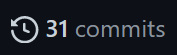

# Estructura de datos

Repositorio creado para hostear el código desarrollado en Estructura de datos.

## *FAQ*

### **¿Y si me califican un 1.0 porque escribiste Vector y no Lista? (Me ha pasado :hurtrealbad: )**
No me hago responsable de ningún error cometido en el código, el repositorio tiene el fin de llevar un control 
de versiones del código escrito en clase, lo recomendable es analizarlo, corregirlo y utilizarlo.

### **Y por que deberia confiar en que su codigo este bueno?**
No deberías...

### **¿Puedo usar el codigo en clase?**
Si, pero debes analizarlo y entenderlo para responder correctamente las preguntas del profesor.

### **¿Puedo ver un historial de cada cambio al codigo?**
Si, para esto dirígete a la pestaña [*Commits*](https://github.com/SanssSepUTP/Data/commits/main).

### **¿Puedo aportar al codigo?**
¡Claro!, puedes escribirme y agregaré tu segmento, si sabes utilizar Github, puedes hacer 
un pull request, y si quieres participar a fondo, puedo darte acceso al repositorio.

> Cualquier duda o sugerencia, puede comunicarse por:

		Whatsapp deberia morir.
